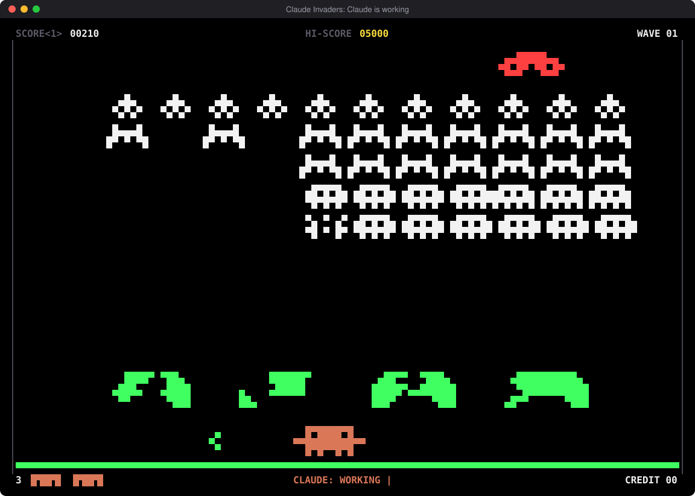
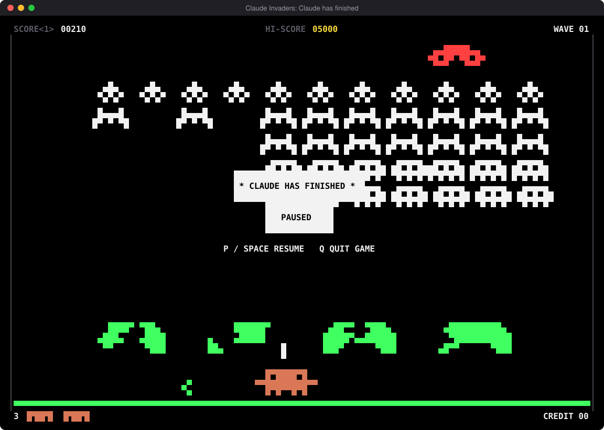
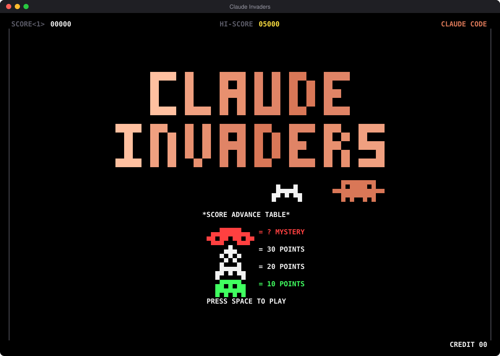
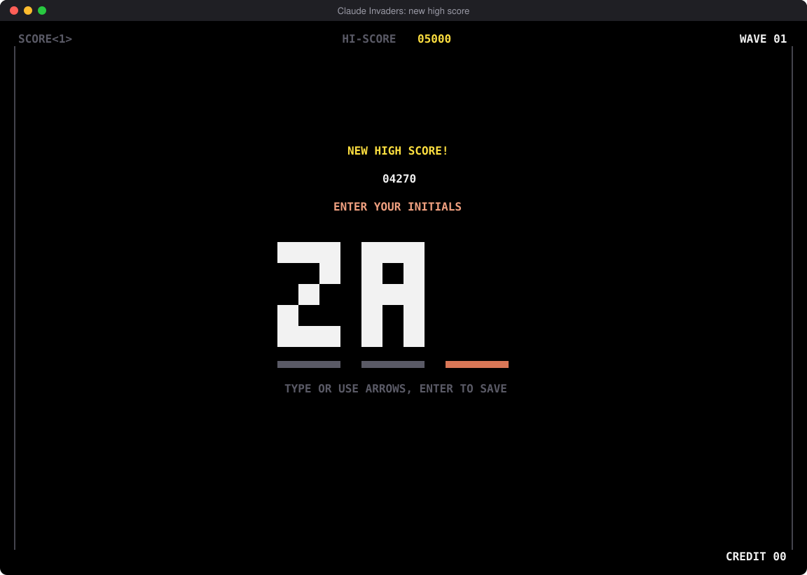

# Claude Invaders

Space Invaders in your terminal, starring Clawd, the Claude Code mascot. Keep it open next
to Claude Code, and it pauses when Claude finishes.



## Install

In Claude Code:

```
/plugin marketplace add DontPanic345/claude-invaders
/plugin install claude-invaders@claude-invaders
```

Then run `/invaders` to open a game in a new window. `/invaders split` opens it in a pane
beside Claude, and `/invaders tab` opens it in a new tab.

## Plays alongside Claude

The footer shows what Claude is doing. When Claude finishes or needs your permission, the
game pauses with a jingle so you know to switch back.



### In the same terminal

Run `/bg` in Claude Code to move the session to the background and get your shell back,
then run `claude-invaders` there. Press C to hand the terminal back to Claude, and Ctrl+Z in
Claude to return to the paused game.

This needs `claude-invaders` on your PATH: `npm install -g github:DontPanic345/claude-invaders`.

## Arcade features

- The march speeds up as the invaders fall, to the original four-note heartbeat.
- Shields crumble under fire, and shots can collide in mid-air.
- The mystery ship hides the original's secret score table.
- There's an extra life at 1,500 points and a top-10 table with three-letter initials.
- An attract mode shows a demo game, the score advance table and "INSERT COIN".
- Chiptune sound effects play on Windows.
- A boss key hides the game behind a fake build log.
- Try the Konami code.



## Controls

| Key       | Action       |
| --------- | ------------ |
| ← → / A D | Move         |
| Space     | Fire         |
| P         | Pause        |
| M         | Sound on/off |
| B         | Boss key     |
| C         | Back to Claude, after `/bg` |
| Q         | Quit         |

Needs a truecolor terminal of at least 80x30, such as Windows Terminal, and Node.js 18 or later.


